# EYE-BRACKER
(By Mirjana Cale)
***

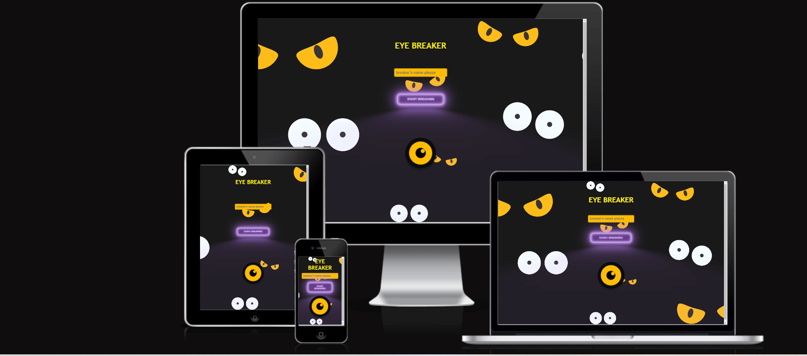

***
### Live pages - https://mirjanacale.github.io/eye-breaker/
***

 
## Introduction
Eye-bracker is a arcade game where the player controls a paddle to deflect a bouncing eyeball. The goal is to smash a wall of colored bricks by hitting them with the eyeball.The paddle moves horizontally.It's a classic that continues to captivate players of all ages.

  ## How to Play

***

* Enter your name on the start screen.
* Click the "Start Breaking" button.
* If you're on a mobile device, turn your device horizontally for the best experience.
* Use the arrow keys or touch controls to move the paddle left and right.
* Bounce the eyeball to break all the blocks.
* Try to clear all the blocks to win!

## Wireframe
***

Wireframe-Start page 
  

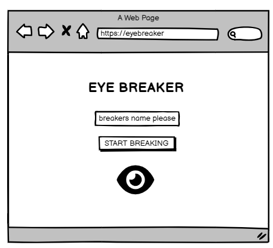

 

Wireframe - Start page Desktop & Tablet
  

 

Wireframe - Start page Mobile
  

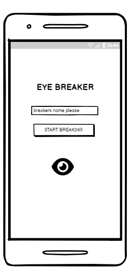

    

Wireframe - Grid page Desktop & Tablet
  

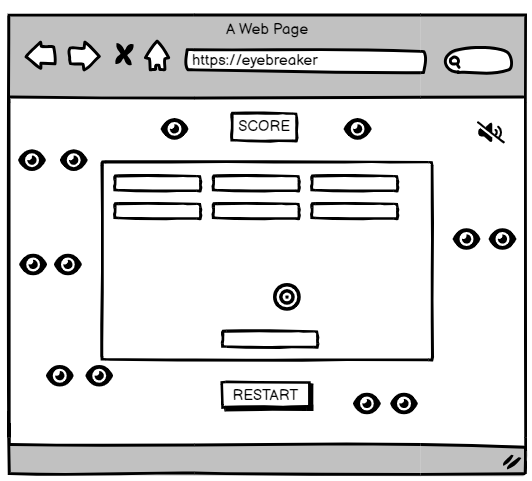

 

Wireframe - Grid page Mobile
  

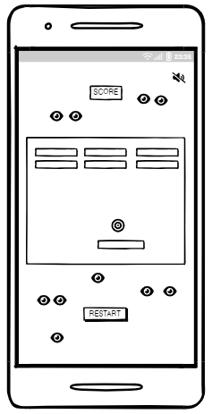

              

## Color Scheme
***
* Readability & Contrast: The stark contrast between black and white makes text and other critical features easy to read.
 * Red, Jounquil, and Mardi Gras are striking hues that contrast with the black background, highlighting important details and actions.
* Emotional Impact: The rich purple creates a feeling of opulence and celebration, while the thoughtful application of red and yellow adds emotional depth and excitement.
* Player immersion and engagement are improved by these emotional cues.
* Aesthetic Balance: A balanced and eye-catching aesthetic is produced by combining bright, strong highlights with a dark, neutral background.   Throughout the game, this equilibrium aids in keeping the player's attention and concentration.

### Color
- Black :#000000
- Mardi Gras :#880276
- White: #FFFFFF
- Red:#E71918
- Jounquil:#FACA05

 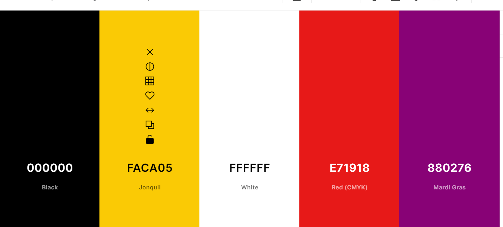

I used the website 
 [colors.co](https://coolors.co/431313-e6690a) to choose the colors for the game.
 The background is video.

 

# Existing Features
***
## Start Page 

### Player Name Input:
* The player can type their name in this input area.

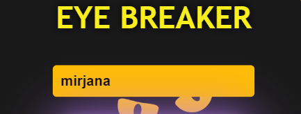

### The "Start" button:
 * launches the game.
 * The player must submit a name  before the game can begin.

 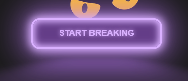

### Player Name Storage:
* When a page loads, the player's name is obtained from the browser's local storage.

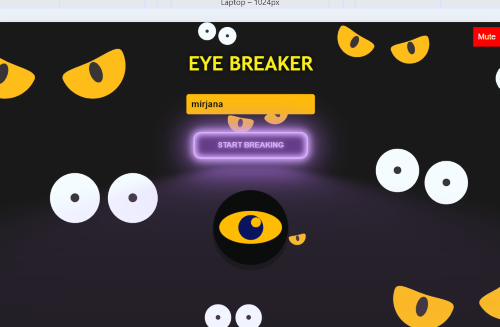

### Oriental message
***
The orientation message is used in the mobile application to guide users on how to properly interact with the game. Specifically, it instructs users to hold their mobile devices horizontally to ensure the best gameplay experience.

## Game Grid Dimensions:
 * The game grid has a red backdrop and is 560 pixels wide by 300 pixels high.
* Positioning: 
Using CSS flexbox and transform attributes, the grid is centered in the viewport.

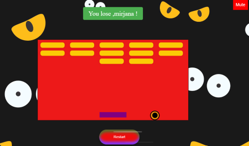

## Blocks

### Block Creation:
 * A Block class with attributes specifying a block's location and size is used to generate blocks.
 * Block Layout:
  At the top of the gaming area, blocks are organized in a grid. Three rows, each with five blocks, are present.

  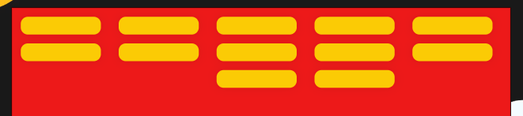

* Block Removal:
 When the ball strikes a block, it is taken out of the DOM.

## User Paddle
  * Paddle Element: 
  A rectangular, purple paddle that the user controls.
 * Keyboard Controls: The arrow keys are used to move the paddle left and right.

 

## Touch Controls:
 When using a touch device, swipe movements cause the paddle to move left or right.
 * Boundary Constraints: 
 The game grid places restrictions on the paddle's movement.

 

## Bouncing Ball (Eyeball)

* A round, yellow ball that bounces around the grid is the eyeball element.

* Movement:
 When the ball collides with walls, blocks, or the paddle, it travels diagonally and changes course.

 

* Collision Detection:
 When the ball collides with walls, blocks, or the paddle, the game detects it and modifies the ball's path appropriately.

# Audio Effects
 * The sound effect known as "Bounce Sound" is produced when the ball strikes walls, blocks, or the paddle.
* Lose Sound: When the ball hits the paddle below, a sound effect is heard.

* Mute Functionality: The player may turn sound effects on and off by pressing the mute button.

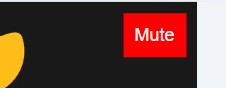

# Scoring Score Display: 
* The top of the grid shows the current score.
Every time a block is broken, the score is increased.

* Winning Condition: 
When every block is broken, the game pauses and shows a winning message.

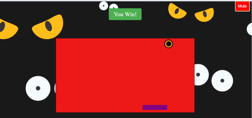

 
# End of game and restart

* Condition of Game Over:
 When the ball touches the paddle below, the game stops and shows a losing message.
* Restart Button:
 This button allows the player to restart the game by reloading it.

 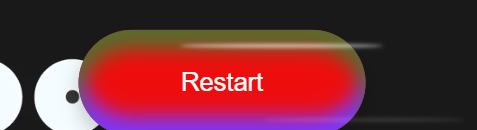

 ## Testing
  ***

  ### **Initial testing plan**

I started by creating a wireframe for my website and then I began coding in HTML, CSS and JS. After that, I tested each :
***

* Check responsiveness by resizing the browser window.
* Run tests on different devices/browsers: Chrome, Firefox, Edge. 

## Testing
***
| Page | Test | Pass/Fail |
| :----| :----| :--------:|
| Player name  |  Ensure the start screen appears with a prompt to enter the player's name. | Pass |
| Start button  | Verify the "Start Game" button is visible and clickable.  | Pass |
| Local storege  | Check that the player's name is stored in local storage and displayed correctly. | Pass |
| Message  | If on a mobile device, check that the orientation message appears when in portrait mode. | Pass |
| Message | Verify that the message disappears when the device is turned horizontally and reappears if turned back to portrait. | Pass |
| Touch controls  | Use touch controls on mobile devices to move the paddle and verify responsiveness. | Pass |
| Eyball direction| Check that the eyeball changes direction upon collision with the paddle or walls. | Pass | 
| Blocks collision| Confirm that blocks are removed upon collision with the eyeball. | Pass |
| Increments of score |Ensure the score increments correctly when a block is hit.  | Pass |
| Score | After losing or winning, verify that clicking the restart button reloads the game correctly. | Pass |
| Game's behavior | Test the game's behavior when switching between portrait and landscape modes during gameplay. | Pass |

##  Browser  Compatibility

Eye bracker is designed to be compatible with  Google Chrome, Mozilla Firefox, Microsoft Edge.

| Broswer tested | Intedend appearance | Screenshot |
| -------------- | :-----------------: | :--------: |
| Chrome         |      Yes            | 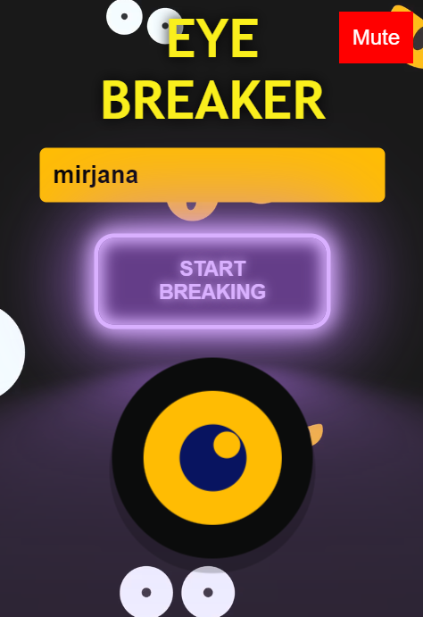      |
| Firefox        |      Yes            |       |
| Edge           |      Yes            |       |

##  Responsiveness Testing

Eye bracker is designed to be compatible with different device sizes.

| Size     | Intedend appearance | Intended responsiveness | Screenshot |
| -------- | :-----------------: | -----------------------:| :--------: |
| Mobile   |      Yes            |              Yes        | 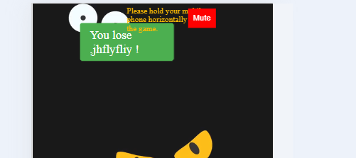      |
| Tablet   |      Yes            |              Yes        |       |
| Desktop  |      Yes            |              Yes        |       |

 ## Validator Testing

 was tested using W3C Markup Validation Service (HTML) and Jigsaw by Google (CSS). 

### HTML
***

The following tools were used for HTML validation:
- [W3C Markup Validation Service](https://validator.w3.org/)

| W3C Link | Screenshot | Notes |
| -------- | :--------: | -----:|
| [index](https://validator.w3.org/nu/#textarea) | 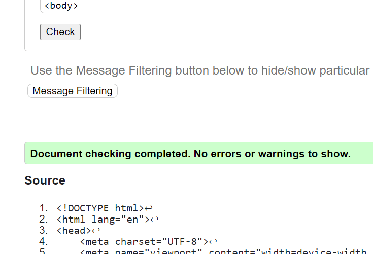 | No errors |
| 

### CSS
***

The following tools were used for CSS validation:
 - [W3C Markup Validation Service](https://jigsaw.w3.org/css-validator/).

| Jigsaw Link | Screenshot | Notes |
| ----------- | :--------: | -----:|
| [styles.css](https://jigsaw.w3.org/css-validator/validator) | 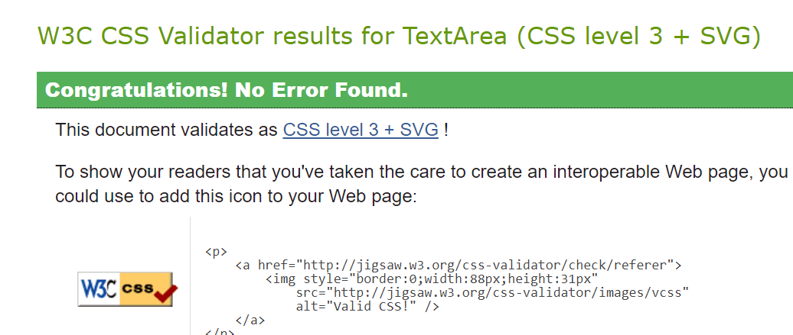 | No errors |

## JS
***
The following tools were used for JSHint validation:
- [JSHint Validation Service](https://jshint.com/)

| W3C Link | Screenshot | Notes |
| -------- | :--------: | -----:|
| [js](https://jshint.com/) | 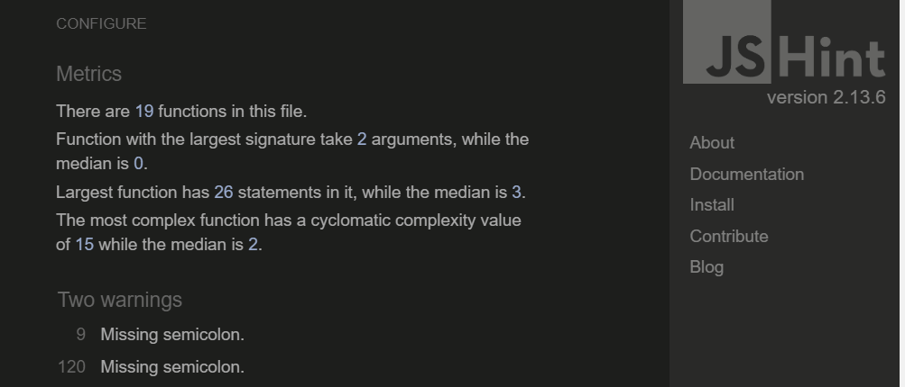 | No errors |
| 

## Lighthouse Testing
***

Lighthouse testing was performed by Google's open source tool, 
[Google Chrome DevTools](https://developers.google.com/web/tools/lighthouse). 

- index.html 

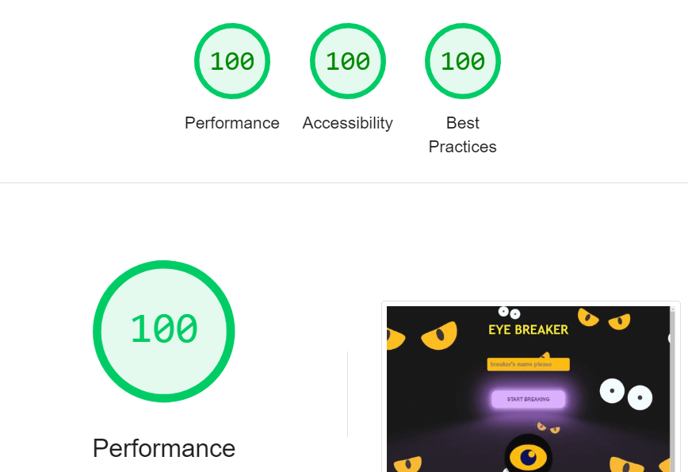

## Deployment

The site was deployed to GitHub Pages. The steps to deploy are as follows:

- In the [GitHub repository](https://mirjanacale.github.io/eye-breaker/), navigate to the Settings tab 
- From the source section drop-down menu, select the **Main** Branch, then click "Save".
- The page will be automatically refreshed with a detailed ribbon display to indicate the successful deployment.

The live link can be found [here](https://mirjanacale.github.io/eye-breaker/)

### Local Deployment

This project can be cloned or forked in order to make a local copy on your own system.

#### Cloning

You can clone the repository by following these steps:

1. Go to the [GitHub repository](https://mirjanacale.github.io/eye-breaker/) 
2. Locate the Code button above the list of files and click it 
3. Select if you prefer to clone using HTTPS, SSH, or GitHub CLI and click the copy button to copy the URL to your clipboard
4. Open Git Bash or Terminal
5. Change the current working directory to the one where you want the cloned directory
6. In your IDE Terminal, type the following command to clone my repository:
	- `git clone https://github.com/mirjanacale/eye-breaker.git`
7. Press Enter to create your local clone.

Alternatively, if using Gitpod, you can click below to create your own workspace using this repository.

Please note that in order to directly open the project in Gitpod, you need to have the browser extension installed.
A tutorial on how to do that can be found [here](https://www.gitpod.io/docs/configure/user-settings/browser-extension).

#### Forking

By forking the GitHub Repository, we make a copy of the original repository on our GitHub account to view and/or make changes without affecting the original owner's repository.
You can fork this repository by using the following steps:

1. Log in to GitHub and locate the [GitHub Repository](https://mirjanacale.github.io/eye-breaker/)
2. At the top of the Repository (not top of page) just above the "Settings" Button on the menu, locate the "Fork" Button.
3. Once clicked, you should now have a copy of the original repository in your own GitHub account!

### Local VS Deployment

There are no major differences between the local (Gitpod) version and the deployed (GitHub Pages) version that I'm aware of.

